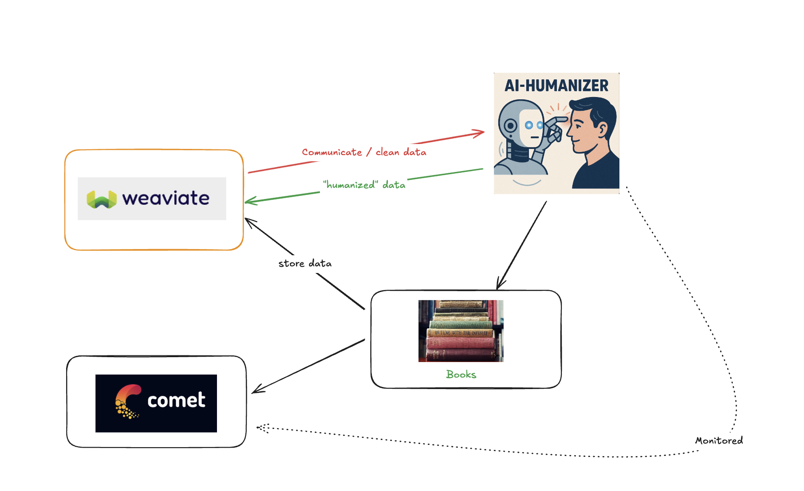

test_cases = [
{
"text": "We regret to inform you that your application has been unsuccessful at this time.",
"category": "corporate_email"
},
{
"text": "The implementation of the aforementioned solution requires comprehensive analysis of existing infrastructure.",
"category": "technical"
},
{
"text": "Pursuant to our previous correspondence, please be advised that the meeting has been rescheduled.",
"category": "formal_communication"
}
]

🤖 Robotic Text Input
↓
🔍 Search Weaviate for Similar Examples
↓
🧠 AI Humanization with Context
↓
💾 Store Results in Weaviate
↓
📊 Track Everything with Opik

